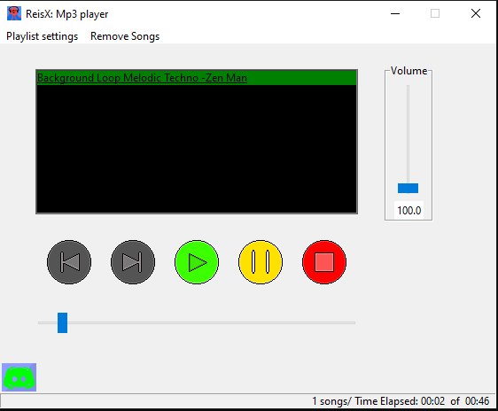
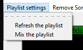
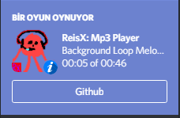
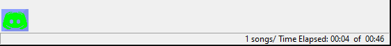

# ReisX: Mp3 Player

 
This is a open source music player written in python.  
The main purpose is to listen to music without reducing the device performance without being exposed to advertisements.  

## Install for Windows
You can [Install](https://github.com/reisgoldmanX/ReisX-Mp3_player/raw/main/ReisX_Mp3-player%3D%3D0.0.2.zip) this zip package then extract it to a folder.  
After that you just start `ReisX_Mp3-player.exe`.

## Usage
**This Music Player only works for Windows.**

First you have to download mp3 files to the `Music` folder. 
You can use [Youtube to mp3 converter](https://yt1s.com/youtube-to-mp3/en1).  
After you are done with downloading run the `ReisX_Mp3-player.exe` program.  
This screen will **pop up**:

The black screen is the Playlist part you can choose the music you want to listen by clicking to the music name. You will figure it out.  
 There is `Playlist settings` in the **top right corner:**

These are the playlist settings you can refresh and mix the playlist by clicking on them.
This music player supports [discord](https://discord.com/) activites this works only with desktop discord app.

# Contributing
Contributions are what make the open source community such an amazing place to be learn, inspire, and create.   
Any contributions you make are greatly appreciated.
### requirements

1. [python==3.8](https://www.python.org/)
2. [Pygame==2.0.1](https://www.pygame.org/wiki/GettingStarted)
3. [mutagen.mp3==1.45.1](https://pypi.org/project/mutagen/)
4. [random](https://docs.python.org/3.8/library/random.html)
5. [time](https://docs.python.org/3.8/library/time.html)
6. [os](https://docs.python.org/3.8/library/os.html)
7. [requests===2.25.1](https://pypi.org/project/requests/)
8. [pypresence==4.2.0](https://github.com/qwertyquerty/pypresence/)
9. [keyboard==0.13.5](https://pypi.org/project/keyboard/)

